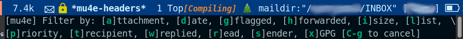

# Mu4e Filters

**This is still in an experimental state. Functions and bindings may
change in a future update. Feedback is very much appreciated.**



Mu4e Filters provides an easy and customizable search filter interface
for the Emacs email client [Mu4e](https://github.com/djcb/mu).
Install, press `,` (`M-x mu4e-filters`) on your message view and
narrow or search your messages by various handy filters.

Mu4e Filters hopes to reduce the overhead of context switching that
the many kinds of messages is a typical inbox impose on a user. A
typical workflow using Mu4e Filter might involve, for example, dealing
with emails from the mailing list at point (`, l`), returning to the
inbox (`\`) dealing with those by the sender at point (`, s`), and so
on.

It also allows users to intuitively and easily perform complex and
non-trivial narrowing and search queries.

For example: *Filter the current email list* (`, l`) *by those involving the sender
at point* (`, s s`) *with a 'Word'-like attachment* (`, a w`) *sent this month* (`, d m`) 
*that I still haven't replied to* (`, w W`).

Pressing `,` will make Mu4e Filters narrow the current header view by
that filter. To perform a global search of all your messages instead,
call it with a prefix argument instead (`C-u ,`).

It has helped me manage my daily email torrent, and I hope it helps
others too!

## Filters

| KEY | FILTER     | INFO                                                                                                          |
|-----|:-----------|:--------------------------------------------------------------------------------------------------------------|
| a   | Attachment | Filter by attachments or specific attachment MIME. Customize via the variable `mu4e-filter-attachment-types`. |
| d   | Date       | Filter by date range or relative date period. Customize via the variable `mu4e-filter-list-of-dates`.         |
| g   | Flagged    | Filter by flagged ('starred') or unflagged messages.                                                          |
| h   | Forwarded  | Filter by forwarded ('passed' or 'handled') messages.                                                         |
| i   | Size       | Filter by messages bigger than n. Customize via the variable `mu4e-filter-sizes`.                             |
| l   | List       | Filter by email list at point. Add implicit email lists via the variable `mu4e-filter-implicit-email-lists`.  |
| p   | Priority   | Filter by message priority (as set by sender).                                                                |
| t   | Recipient  | Filter by the address in the :to field at point.                                                              |
| w   | Replied    | Filter by replied or unreplied messages.                                                                      |
| r   | Read       | Filter by read or unread messages.                                                                            |
| s   | Sender     | Filter by sender at point.                                                                                    |
| x   | GPG        | Filter by encrypted or signed messages.                                                                       |

This list can be customized with the variable `mu4e-filters-enabled`.

## Installation

Until I feel like this is stable enough to be submitted to MELPA,
you'll need to clone this repo to your computer and import it in
your `init.el` or `.emacs` with `load-file`. For example:

``` emacs-lisp
(load-file "path/to/mu4e-filters.el")
```

## Customization

You can customize the behaviour of mu4e-filters via the mu4e-filters
menu in the Customize menu (`M-x customize-group RET mu4e-filters
RET`).

Otherwise see the documentation for the variables `mu4e-filters-enabled`,
`mu4e-filter-attachment-types`, `mu4e-filter-list-of-dates`,
`mu4e-filter-implicit-email-lists`, `mu4e-filter-sizes`.

## Support, suggestions and other feedback

All very welcomed. This is my first attempt to give back to the Emacs
community. Please get in touch via Github issues.
